<h1>Notes from Andrej Karpathy's building micrograd video.</h1>
<p>
Date: 13/02/2024
Abhishek Mishra
</p>

<hr/>

**Table of Contents**

- [1. About these Notes](#1-about-these-notes)
- [2. Part 0: micrograd overview](#2-part-0-micrograd-overview)
  - [2.1. Neural Networks](#21-neural-networks)
- [3. Part 1: Derivative of a simple function with one input](#3-part-1-derivative-of-a-simple-function-with-one-input)
  - [3.1. Derivative of the Expression](#31-derivative-of-the-expression)
  - [3.2. Derivative at Another Point (x = -3)](#32-derivative-at-another-point-x---3)
  - [3.3. Derivative goes to 0](#33-derivative-goes-to-0)
- [4. Part 2: A More Complex Case](#4-part-2-a-more-complex-case)
- [5. Part 3: Expressions for Neural Networks](#5-part-3-expressions-for-neural-networks)
  - [5.1. Core Value Object](#51-core-value-object)
  - [5.2. Addition of Value Objects](#52-addition-of-value-objects)
  - [5.3. Multiplication of Value Objects](#53-multiplication-of-value-objects)
  - [5.4. Children of Value Objects](#54-children-of-value-objects)
  - [5.5. Storing the Operation](#55-storing-the-operation)
  - [5.6. Visualizing the Expression Graph](#56-visualizing-the-expression-graph)
  - [5.7. Label for Each Value Node in the Graph](#57-label-for-each-value-node-in-the-graph)
  - [5.8. Recap so far](#58-recap-so-far)
- [6. Part 4: Manual Back-propagation of an Expression](#6-part-4-manual-back-propagation-of-an-expression)
- [7. Part 5: Single Optimization Step: Nudge Inputs to Change Loss](#7-part-5-single-optimization-step-nudge-inputs-to-change-loss)
- [8. Part 6: Manual Back-propagation of a Single Neuron](#8-part-6-manual-back-propagation-of-a-single-neuron)
  - [8.1. The tanh function](#81-the-tanh-function)
  - [8.2. tanh support in Value class](#82-tanh-support-in-value-class)
  - [8.3. Expression for a Neuron](#83-expression-for-a-neuron)
  - [8.4. Backpropagation on a Neuron](#84-backpropagation-on-a-neuron)
- [9. Part 7: Backpropagation Implementation](#9-part-7-backpropagation-implementation)
  - [9.1. \_backward function for \_\_add](#91-_backward-function-for-__add)
  - [9.2. \_backward function for \_\_mul](#92-_backward-function-for-__mul)
  - [9.3. \_backward function for tanh](#93-_backward-function-for-tanh)
  - [9.4. Redoing the backpropagation on the expression using `_backward`](#94-redoing-the-backpropagation-on-the-expression-using-_backward)
- [10. Part 8: Backpropagation for the entire expression graph](#10-part-8-backpropagation-for-the-entire-expression-graph)
  - [10.1. Implement the `backward` function in `Value` class](#101-implement-the-backward-function-in-value-class)
- [11. Part 9: Fixing backprop bug when using a node multiple times.](#11-part-9-fixing-backprop-bug-when-using-a-node-multiple-times)
  - [11.1. A longer expression](#111-a-longer-expression)
  - [11.2. Solution for the bug](#112-solution-for-the-bug)
  - [11.3. Examples fixed](#113-examples-fixed)
- [12. Part 10: Breaking up tanh: Adding more operations to `Value`](#12-part-10-breaking-up-tanh-adding-more-operations-to-value)
  - [12.1. Supporting constants in `Value.__add`](#121-supporting-constants-in-value__add)
  - [12.2. Adding support for exponentiation in `Value`](#122-adding-support-for-exponentiation-in-value)
  - [12.3. Adding support for division and subtraction](#123-adding-support-for-division-and-subtraction)
  - [12.4. Sample expression with tanh expanded](#124-sample-expression-with-tanh-expanded)
- [13. Part 11: The same example in PyTorch](#13-part-11-the-same-example-in-pytorch)
- [14. Part 12: Building a neural net library (multi-layer perceptron)](#14-part-12-building-a-neural-net-library-multi-layer-perceptron)
  - [14.1. Multi-layer perceptron](#141-multi-layer-perceptron)
  - [14.2. Complete MLP](#142-complete-mlp)
- [15. Part 13: Working with a tiny dataset, writing a loss function](#15-part-13-working-with-a-tiny-dataset-writing-a-loss-function)
- [16. Part 14: Collecting the parameters of the neural net](#16-part-14-collecting-the-parameters-of-the-neural-net)
- [17. Part 15: Manual gradient descent to train the network](#17-part-15-manual-gradient-descent-to-train-the-network)
  - [17.1. Changing the parameters](#171-changing-the-parameters)
  - [17.2. Convert our manual steps into a loop](#172-convert-our-manual-steps-into-a-loop)
  - [17.3. Fixing a **bug** in the training](#173-fixing-a-bug-in-the-training)
- [18. Summary of the Lecture](#18-summary-of-the-lecture)
- [19. References](#19-references)
- [20. Appendix](#20-appendix)

# 1. About these Notes

Recently I came across Andrej Karpathy's 
["building micrograd" video on youtube][1], after reading a mention of it on 
hackernews perhaps 🤔 (not sure).

I watched the whole video first. Then I was so intrigued I decided to implement
the same engine in a language which is *not python*, so that I can work through
the development of the engine and get it working and also test the results with 
Andrej's version.

In the second pass I watched the video and took notes about what Andrej was
explaining as well as about the python code.

In the third and later passes I slowly implemented the code for each section
and added the code and the results back to this document.


# 2. Part 0: micrograd overview

In this section of tutorial, Andrej provides an overview of micrograd. It is
an autograd engine. It implments backpropagation (reverse mode autodiff) over
a dynamically built DAG.
It is also a small neural networks library with a PyTorch-like API
Micrograd basically allows you to build out mathematical expressions,
and he shows us an example (from the README.md of micrograd).

The library builds an expression and through a forward pass calculates
the value of the expression. It then uses backpropagation to calculate
the gradients of the expression with respect to the input variables.

## 2.1. Neural Networks

TODO: this section has just sentence fragments, rephrase the points.

* Neural Networks are just mathematical expressions
* Take the weights of the neural network and input data as input, and produce
and output.
* backpropagation is more general than neural networks, it works with any
mathematical expression.
* Finally, micrograd is built using scalars, which is inefficient, but
simplifies the implmentation and allows us to understand the backpropagation 
and the chain rule.
* When we want to train a larger network we should be using Tensors.
* Andrej's claim is that micrograd is complete. It has only two files engine.py
which knows nothing about neural networks, and nn.py which is a neural
network library built on top of engine.py.
* engine.py is literally 100 lines of code in Python. And nn.py is just 60
lines and is a total joke (sic).
* There's a lot to efficiency, but you can get to a working neural network all
  in less than 200 lines of code.

# 3. Part 1: Derivative of a simple function with one input

* Lets get a very good intuitive understanding of what a derivative is.
* Lets define a scalar valued function f(x), and get its value.

```lua
function f(x)
    return (3*(x^2)) - (4*x) + 5
end

f(3.0)
-- 20.0
```

* We can also plot this function over a range of values.

```lua
for x = -5,5,0.25 do
    print(x, f(x))
end

-- values plot given below
```


## 3.1. Derivative of the Expression
* Now we will think about the derivative of the expression.
* See the [Differentiation rules][2]
* In neural networks no one actually writes an expression and derives it.
* We are not going for the symbolic approach.
* We will try and understand what the derivative is measuring and what it is
  telling us about the function.
* We look at the definition of the derivative in terms of Limit from the wiki
  page of derivative.
TODO: update the definition of derivative here.
* Basically how does the function respond to an infinitesimal change in the
  input variable. What is the slope of the function at the point.

```lua
-- if we use too small h, we will eventuall get an incorrect value because
-- we are using floating point arithmetic.
h = 0.00001
x = 3.0

f(x+h)
-- 20.014003

(f(x+h) - f(x))/h
-- 14.003000000002
```

* From the above we can conclude that at x=3 the slope of f(x) is 14.
* We can also calculate using the derivative of f(x).
* f'(x) or df(x)/dx = 6*x - 4
* Therefore f'(x) at x = 3 is 14.

## 3.2. Derivative at Another Point (x = -3)

* Let's calculate slope at another point, say x = -3
* Even looking at the plot we can see that the slope of the function at x = -3
  is negative. Therefore the sign of the slope will be 'minus'.
* Slope or f'(-3) is -22.

```lua
x = -3

(f(x+h) - f(x))/h
-- -21.999970000053
```

## 3.3. Derivative goes to 0

* At x=2/3, the function's slope is 0.
* So the function will not respond to a nudge at this point.

```lua
x = 2/3

(f(x+h) - f(x))/h
-- 3.0000002482211e-05
```

# 4. Part 2: A More Complex Case

* Let's take a function with more than one inputs.
* We consider a function with three scalar inputs - a, b, c with a single output
  d.

```lua
a = 2.0
b = -3.0
c = 10.0

d = a*b + c

d
-- 4.0
```

* Now we would like to get the derivative of d w.r.t a, b and c.
* We would like to get the intuition of what this will look like.
* Lets start with derivative with respect to a. This means we will change a by
  a small amount and calculate d. And then we will calculate slope at the point.
* The value of d reduces by a small amount when we increase h by a small amount,
  as a is multiplied by b in the expression, and b is negative. Thus increase
  in a decreases the value of d.
* This gives us an intuition about the slope of d with respect to a.
* Note that using rules of differentiation also we will get the same answer
  as the calculation below.
* d(d)/da = b; therefore slope is b = -3.0

```lua
h = 0.00001
a = 2.0
b = -3.0
c = 10.0

d1 = a*b + c

a = a + h

d2 = a*b + c

print('d1 = ' .. d1)
-- d1 = 4.0
print('d2 = ' .. d2)
-- d2 = 3.99997
print('slope = ' .. (d2 - d1)/h)
-- slope = -3.0000000000641
```

* Now lets consider the derivative of d w.r.t. b.
* Again from the rules of differentiation d(d)/db = a.
* Therefore we should expect the answer 2.0.

```lua
h = 0.00001
a = 2.0
b = -3.0
c = 10.0

d1 = a*b + c

b = b + h

d2 = a*b + c

print('d1 = ' .. d1)
-- d1 = 4.0
print('d2 = ' .. d2)
-- d2 = 4.00002
print('slope = ' .. (d2 - d1)/h)
-- slope = 2.0000000000131
```

* Finally lets consider the derivative of d w.r.t. c.
* From the rules of differentiation d(d)/dc = 1.
* With changes in c, d changes by the exact same amount.

```lua
h = 0.00001
a = 2.0
b = -3.0
c = 10.0

d1 = a*b + c

c = c + h

d2 = a*b + c

print('d1 = ' .. d1)
-- d1 = 4.0
print('d2 = ' .. d2)
-- d2 = 4.00001
print('slope = ' .. (d2 - d1)/h)
-- slope = 0.99999999996214
```

* We have some intuitions about how expressions and their derivatives will work.
* Lets move to neural networks which will have massive expressions.

# 5. Part 3: Expressions for Neural Networks

As mentioned neural networks will have massive expressions. So we need some
datastructure to maintain the massive expressions. And so we will build out the
`Value` object which was shown in the beginning of the video, from the README
of the micrograd project.

## 5.1. Core Value Object

* Lets start with the skeleton of a very simple value object.
* *Lua Note:* Lua is object-oriented but does not have classes. To keep the
  structure of the code similar to the one in the video,
  we will write the classes using the excellent [*middleclass*][3] library.
    - The code will be slightly more verbose than python.
* Here we create a simple value class, then create an instance `a`, and
  finally print it out.
* *Lua Note:* To make sure the code can be run in an interpreter, all Lua
  variables are being created in global scope. Usually we would write the code
  in files, and make sure that the variables are marked `local`.

```lua
class = require 'lib/middleclass'

-- Declare the class Value
Value = class('Value') -- 'Value' is the class' name

-- constructor
function Value:initialize(data)
  self.data = data
end

-- tostring
function Value:__tostring()
  return 'Value(data = ' .. self.data .. ')'
end

a = Value(2.0)

a
-- Value(data = 2.0)
```

## 5.2. Addition of Value Objects

* Now, we would like to create mutliple values and also be able to do things
like `a + b` where `a` and `b` are values.
* We're going to use the metamethod `__add` in Lua to allow us to define 
  addtion for Value objects.
* The addition inside `Value:__add` is a simple floating point addition of the
  data of two Value objects.

```lua
class = require 'lib/middleclass'

function Value:initialize(data)
  self.data = data
end

function Value:__tostring()
  return 'Value(data = ' .. self.data .. ')'
end

-- add this Value object with another
-- using metamethod _add
function Value:__add(other)
  return Value(self.data + other.data)
end

a = Value(2.0)
b = Value(-3.0)

-- this line will invoke the metamethod Value:__add
a + b
-- Value(data = -1.0)

```

## 5.3. Multiplication of Value Objects

* Multiplication of Value objects is fairly simple and uses the `__mul`
  metamethod.
* This will now help us write expressions like `a * b` and `a * b + c`.

```lua
-- Class definition same as in the previous snippet.
-- multiply this Value object with another
-- using metamethod _mul
function Value:__mul(other)
  return Value(self.data * other.data)
end

a = Value(2.0)
b = Value(-3.0)
c = Value(10.0)

a * b
-- Value(data = -6.0)

-- the next line is equivalent to
-- (a.__mul(b)).__add(c)
d = a * b + c

d
--Value(data = 4.0)
```

## 5.4. Children of Value Objects

* What we're missing is the connective tissue of the expression.
* We want to keep these expression graphs, so we need to keep pointers about
  what values produce what other values.
* So we're going to introduce a new variable called `_children` which will be
  by default an empty tuple.
* *Lua Note:* Lua does not have tuples. In fact it has only one in-built
  compound datatype **tables**. So we're going to use a table to store
  `_children`.
* Internally the `children` are stored as **set** for efficiency.
* *Lua Note:* Lua does not have sets either. However sets can be eumulated in
  Lua using tables by keeping the elements as *indices* of a table. See 
  [11.5 – Sets and Bags (Programming in Lua)][4] for details of this approach.

```lua
class = require 'lib/middleclass'
Set = require 'util/set'

Value = class('Value')

function Value:initialize(data, _children)
  self.data = data
  if _children == nil then
    self._prev = Set.empty()
  else
    self._prev = Set(_children)
  end
end

function Value:__tostring()
  return 'Value(data = ' .. self.data .. ')'
end

function Value:__add(other)
  return Value(self.data + other.data, {self, other})
end

function Value:__mul(other)
  return Value(self.data * other.data, {self, other})
end

a = Value(2.0)
b = Value(-3.0)
c = Value(10.0)

d = a * b + c

d._prev
-- {Value(data = -6.0), Value(data = 10.0)}

```

## 5.5. Storing the Operation

* In addition to the children for a Value, we will also store the operation which
was used to generate the Value.
* `_op` will be a private variable storing the operation as a string.

```lua
class = require 'lib/middleclass'
Set = require 'util/set'

Value = class('Value')

function Value:initialize(data, _children, _op)
  self.data = data
  self._op = _op or ''
  if _children == nil then
    self._prev = Set.empty()
  else
    self._prev = Set(_children)
  end
end

function Value:__tostring()
  return 'Value(data = ' .. self.data .. ')'
end

function Value:__add(other)
  return Value(self.data + other.data, {self, other}, '+')
end

function Value:__mul(other)
  return Value(self.data * other.data, {self, other}, '*')
end

a = Value(2.0)
b = Value(-3.0)
c = Value(10.0)

d = a * b + c
d._op
-- +
```

## 5.6. Visualizing the Expression Graph

* Since the expressions we write will get larger, Andrej introduces some code to
generate a GraphViz plot of the expression graph, using a python libary.
* *Lua Note*: Since there is no cross-platform graphviz library available, I've
  implemented a small utility which calls the `graphviz dot` program with a
  temporary dot file and generates the graph in png format.

```lua
trace_graph = require("util/trace_graph")
trace_graph.draw_dot_png(d, "plots/plot1-graph_of_expr.png")

```


## 5.7. Label for Each Value Node in the Graph

* To improve the display of the expression graph, we will add a label to each
  node to help us identify the variable in at each node.
* We will also use a slightly larger expression this time.

```lua
class = require 'lib/middleclass'
Set = require 'util/set'

--- Declare the class Value
Value = class('Value')

--- static incrementing identifier
Value.static._next_id = 0

--- static method to get the next identifier
function Value.static.next_id()
    local next = Value.static._next_id
    Value.static._next_id = Value.static._next_id + 1
    return next
end

--- constructor
function Value:initialize(data, _children, _op, label)
    self.data = data
    self._op = _op or ''
    self.label = label or ''
    self.id = Value.next_id()
    if _children == nil then
        self._prev = Set.empty()
    else
        self._prev = Set(_children)
    end
end

--- string representation of the Value object
function Value:__tostring()
    return 'Value(data = ' .. self.data .. ')'
end

--- add this Value object with another
-- using metamethod _add
function Value:__add(other)
    return Value(self.data + other.data, { self, other }, '+')
end

--- multiply this Value object with another
-- using metamethod _mul
function Value:__mul(other)
    return Value(self.data * other.data, { self, other }, '*')
end

a = Value(2.0)
a.label = 'a'
b = Value(-3.0)
b.label = 'b'
c = Value(10.0)
c.label = 'c'

e = a * b
e.label = 'e'

d = e + c
d.label = 'd'

f = Value(-2.0)
f.label = 'f'

L = d * f
L.label = 'L'

-- print the graph
trace_graph = require("util/trace_graph")
trace_graph.draw_dot_png(L, "plots/plot2-expr_with_label.png")

```


## 5.8. Recap so far

* We're able to build out mathematical expressions with `+` and `*`.
* Expressions are scalar valued.
* We can do a forward pass and calculate the values at each node of the
  expression.
* We have inputs like a, b, c and output L.
* We can visualize the forward pass in a graph.

*Next Steps:* We're going to start at the end of the expression (the output) and
calculate the gradient/derivative of each output w.r.t each node. This is called
**back-propagation**. So in the example above we will calculate dL/dL, dL/df,
dL/dd etc.

In the neural network setting we're very interested in the derivative of the
loss function L w.r.t the weights of the neural network. So for now there are
these internal nodes, which will eventually be the weights of a neural network.
And we will need to know how those weights are impacting the loss function.
 
We will usually not be interested in the derivative of the loss function w.r.t
the input data nodes, because the data is fixed. We will iterate upon the
weights of the neural network.

So in the next steps we will change the `Value` class to maintain the derivative
of the loss w.r.t to this value. And this member of the `Value` class will be
called `grad`. The value of `grad` initial will be 0, which means no effect. At
initialization we assume every value does not impact the output/loss. Changing
this variable does not change the loss.

```lua
--- constructor
function Value:initialize(data, _children, _op, label)
    self.data = data
    self.grad = 0
    self._op = _op or ''
    self.label = label or ''
    self.id = Value.next_id()
    if _children == nil then
        self._prev = Set.empty()
    else
        self._prev = Set(_children)
    end
end

a = Value(2.0)
a.label = 'a'
b = Value(-3.0)
b.label = 'b'
c = Value(10.0)
c.label = 'c'

e = a * b
e.label = 'e'

d = e + c
d.label = 'd'

f = Value(-2.0)
f.label = 'f'

L = d * f
L.label = 'L'

trace_graph.draw_dot_png(L, "plots/plot3-with_grad.png")

```


# 6. Part 4: Manual Back-propagation of an Expression

* We can start with `L` in the expression above. And calculate the derivative of
  L w.r.t L, which will be one. This can also be demonstrated by calculating
  `((L + h) - L) / h`, which will be `h/h` i.e. 1.
* Now we can write a function to calculate the derivative of `L` w.r.t the other
  `Values` and write them down.
 
```lua
function lol()
  local a, b, c, d, e, f, L
  local h = 0.001

  a = Value(2.0)
  a.label = 'a'
  b = Value(-3.0)
  b.label = 'b'
  c = Value(10.0)
  c.label = 'c'
  e = a * b
  e.label = 'e'
  d = e + c
  d.label = 'd'
  f = Value(-2.0)
  f.label = 'f'
  L = d * f
  L.label = 'L'
  local L1 = L.data

  a = Value(2.0)
  a.label = 'a'
  b = Value(-3.0)
  b.label = 'b'
  c = Value(10.0)
  c.label = 'c'
  e = a * b
  e.label = 'e'
  d = e + c
  d.label = 'd'
  f = Value(-2.0)
  f.label = 'f'
  L = d * f
  L.label = 'L'
  local L2 = L.data + h

  print((L2 - L1)/h)
end

lol()
-- 1.0000000000003
```

* Now let's set dL/dL to 1.0 and redraw the graph

```lua
L.grad = 1.0
trace_graph.draw_dot_png(L, "plots/plot4-L_grad.png")

```


* Now let's calculate dL/df and dL/dd.
* since L = f * d, then by rules of differentiation we have
  - dL/df = d = 4.0, and
  - dL/dd = f = -2.0
* We can also modify the above function to apply `+h` to d and f in turn to
  calculate this programmatically.

```lua
d.grad = -2.0
f.grad = 4.0
trace_graph.draw_dot_png(L, "plots/plot5-f_and_d_grad.png")

```


* Now going back in the network let's calculate dL/dc and dL/de.
* Here we will use the rule that `df/dx = df/dy * dy/dx`. This is the
  **chain rule of calculus**.
* See the [Intuitive explanation of the chain rule][5].
* Since `dL/dd` is known then if we can calculate `dd/dc` then we can get
  `dL/dc = dL/dd * dd/dc`.
* We can use similar reasoning for `dL/de`.
* `dd/dc` and `dd/de` are **local gradients**.
* Given `d = c + e`, as we can see from the expression, `dd/dc = 1.0` and also
  `dd/de = 1.0`.
* And so `dL/dc = dL/dd * dd/dc = -2.0 * 1.0 = -2.0`.
* And `dL/de = dL/dd * dd/de = -2.0 * 1.0 = -2.0`.

```lua
c.grad = -2.0
e.grad = -2.0
trace_graph.draw_dot_png(L, "plots/plot6-c_and_e_grad.png")

```


* We have one more layer remaining to go back to.
* Lets calculate the gradient for `a` and `b`.
* We will apply the chain rule again.
* Since `e = a * b`, `de/db = a` and `de/da = b`.
* Since `dL/de = -2.0` and `de/da = b = -3.0`, therefore
  `dL/da = dL/de * de/da = -2.0 * -3.0 = 6.0`
* Similarly `dL/db = dL/de * de/db = -2.0 * a  = -2.0 * 2.0 = -4.0`.

```lua
a.grad = 6.0
b.grad = -4.0
trace_graph.draw_dot_png(L, "plots/plot7-a_and_b_grad.png")

```


*Note:* At each step above, Andrej also modifies the function lol() and
verifies the derivative value programmatically. I haven't repeated the code as
it is self explanatory but quite verbose.

* At this point we can consider what back-propagation is, it is the multiplying
  the derivatives backward through the expression graph by applying the chain
  rule, till we reach the leaf nodes, and all nodes have their gradient/
  derivative applied.

# 7. Part 5: Single Optimization Step: Nudge Inputs to Change Loss

* Now that we know the gradients at each input, we can verify that when we
  change the inputs by a small amount **nudge it**, then we can creat a small
  change in the `L`.

```lua
a.data = a.data + (0.01 * a.grad)
b.data = b.data + (0.01 * b.grad)
c.data = c.data + (0.01 * c.grad)
d.data = d.data + (0.01 * d.grad)
e = a * b
d = e + c
L = d * f
L.data
-- -7.4352
```

# 8. Part 6: Manual Back-propagation of a Single Neuron

* We're going to do a more useful example of manual backpropagation, for a
  neuron.
* Andrej refers to an image of a neuron in his video which is from the course
  notes of [CS231n: Convolutional Neural Networks for Visual Recognition][5].
* He also refers to an image of two-layer neural net - multi-layer perceptrons
  from the same course notes.
* I've included both the images below for reference.


**Salient Points**
* The two-layer networks contains multiple neurons connected to each other.
* Biologically, neurons are complicated.
* We have simple mathematical representations/models of them.
* The image of the single neuron above has the following:
  * *Inputs* - some input data, there are multiple inputs say xi, where i is a
    number.
  * *Synapses* - connecting input data to neuron, that have weights in them.
    The `wi` are weights. What flows to the cell body are the multiplication of
    synapse weights with the inputs i.e. `wi * xi`.
  * *Bias* - the cell body has some bias `b`. This is the *innate*
    *trigger-happiness(sic)* of the neuron. It is added to the sum of the
    weighted inputs of the neuron.
  * *Activation Function* - the weight sum plus bias of the cell are taken
    through an activation function. This activation function is usually some
    kind of a *squashing function(sic)* - like a sigmoid, or tanh or similar.

## 8.1. The tanh function

* We're going to use the `tanh` for our activation function.
* *Lua Note:* Lua does not have `tanh` function, so I've implemented a simple
  version in the util/tanh.lua.

```lua
tanh = require('util/tanh')

datfile = io.open('plots/plot8-tanh.data', 'w')

--- print x and tanh(x) as a table
for x = -5, 5, 0.2 do
  print(x .. ' ' .. tanh(x))
  datfile:write(x .. ' ' .. tanh(x) .. '\n')
end

datfile:close()

-- -5.0 -0.9999092042626
-- -4.8 -0.99986455170076
-- -4.6 -0.99979794161218
-- output snipped

```
* Here is the gnuplot script to plot the data, followed by the plot.
* *Salient Points:*
  * The input as it comes in, the output gets squashed initially.
  * As the input grows output starts rising quite fast and at some point starts
    rising linearly.
  * Finally at a particular value the function starts to plateau again, and
    then the increase almost stops completely.
  * Input as it comes in we're going to cap it smoothly at 1, and at the
    negative side we're going to cap it smoothly to -1.

```gnuplot
# Image output of size 800x600
set terminal png size 800,600
# Output file name
set output 'plot8.png'
# Plot title
set title 'f(x) = tanh(x)'
# Set the grid
set grid
# Plot the data
plot 'plot8-tanh.data' with linespoints
```


* So finally what comes out of the neuron is the weighted sum of inputs 
  $$w_i x_i$$, plus a bias `b`, squashed by an activation function `f`.

$$ f \left( \sum_i w_i x_i + b\right) $$

## 8.2. tanh support in Value class

* Before we can use the tanh function we need to add support for this in our
  Value class.
* Here's what the implementation looks like...

```lua
function Value:tanh()
    local x = self.data
    local t = (math.exp(2 * x) - 1)/(math.exp(2 * x) + 1)
    return Value(t, { self }, 'tanh')
end
```

## 8.3. Expression for a Neuron

* let's create a neuron expression with inputs, weights, bias and activation
  function now.

```lua
-- inputs x1, x2
x1 = Value(2.0); x1.label = 'x1'
x2 = Value(0.0); x2.label = 'x2'
-- weights w1, w2
w1 = Value(-3.0); w1.label = 'w1'
w2 = Value(1.0); w2.label = 'w2'
-- bias of the neuron
b = Value(6.7); b.label = 'b'
x1w1 = x1 * w1; x1w1.label = 'x1w1'
x2w2 = x2 * w2; x2w2.label = 'x2w2'
x1w1x2w2 = x1w1 + x2w2; x1w1x2w2.label = 'x1w1 + x2w2'
n = x1w1x2w2 + b; n.label = 'n'
o = n:tanh(); o.label = 'o'

-- print the graph
trace_graph = require("util/trace_graph")
trace_graph.draw_dot_png(o, "plots/plot9-neuron_expr.png")
```

## 8.4. Backpropagation on a Neuron

* Andrej sets some specific value of bias, in the previous expression, so that
  gradients will be easier to calculate.
* Lets set the same values here:

```lua
-- inputs x1, x2
x1 = Value(2.0); x1.label = 'x1'
x2 = Value(0.0); x2.label = 'x2'
-- weights w1, w2
w1 = Value(-3.0); w1.label = 'w1'
w2 = Value(1.0); w2.label = 'w2'
-- bias of the neuron
b = Value(6.8813735870195432); b.label = 'b'
x1w1 = x1 * w1; x1w1.label = 'x1w1'
x2w2 = x2 * w2; x2w2.label = 'x2w2'
x1w1x2w2 = x1w1 + x2w2; x1w1x2w2.label = 'x1w1 + x2w2'
n = x1w1x2w2 + b; n.label = 'n'
o = n:tanh(); o.label = 'o'

-- print the graph
trace_graph = require("util/trace_graph")
trace_graph.draw_dot_png(o, "plots/plot10-neuron_b_changed.png")
```

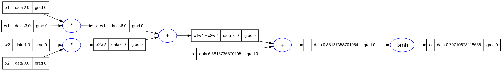

* Lets start out with `o`, the output node. What is `do/do`. The base case,
  it is 1.

```lua
o.grad = 1
```

* To calculate `do/dn`, where `o = tanh(n)` we need to know the derivative of
  tanh.
* Derivative of tanh is `1 - tanh^2(x)`.
* So `do/dn = 1 - (tanh(n) ** 2) = 1 - o**2`

```lua
n.grad = 1 - (o.data ^ 2)
n.grad
-- 0.5
```

* Lets go one more level back.
* And we have a plus operation. We know from earlier in our expression analysis
  that + is just a distributor of the gradient.

```lua
x1w1x2w2.grad = n.grad
b.grad = n.grad
```

* We have another plus next, so we will distribute the gradient again.

```lua
x2w2.grad = x1w1x2w2.grad
x1w1.grad = x1w1x2w2.grad
```

* The next two are `*` nodes. In a multiple/times node, we know that the local
  derivative of one term is the other term multiplied with the gradient of the
  result.
* So setting these we have...

```lua
x2.grad = w2.data * x2w2.grad
w2.grad = x2.data * x2d2.grad
x1.grad = w1.data * x1w1.grad
w1.grad = x1.data * x1w1.grad

trace_graph.draw_dot_png(o, "plots/plot11-neuron_with_grads.png")
```

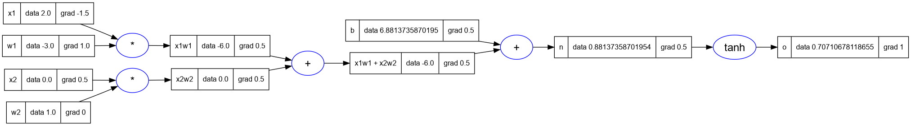

* Notice that since `x2 = 0`, therefore the gradient of its weight `w2.grad = 0`
* This is according to our intuition, because the input is zero, so the result
  does not impact the next node.
* So these are the final derivatives.

# 9. Part 7: Backpropagation Implementation

* Now that we know how gradients can be calculated manually in the expression
  graph, we can start to implement this backpropagation of gradients in the
  `Value` class.
* We will now have `_backward` a member of the `Value` class which will help
  us chain the output gradient to the input gradient.
* By default this will be a function which will do nothing. In micrograd python
  version this is written as `_backward = lambda: None`.
* This empty function will be the case for for e.g. the leaf node. For a leaf
  node there is nothing to backpropagate.
* But when we are creating a `Value` using one of the supported operations,
  we would be creating new `Value` objects.
* Then we will have to define the current `Value` objects gradient.
* The idea is to propagate the output's gradient to self's gradient and other's 
  gradient in some way. And how it is propagated is different for each
  supported operation
* The pseudocode looks like

```lua
function _backward()
  self.grad = ???
  other.grad = ???
end

out._backward = _backward
```

## 9.1. _backward function for __add

* For e.g. for the add operation `self._grad = 1.0 * out.grad`, and similarly
  `other._grad = 1.0 * out.grad`.
* Therefore the newly created `_backward` can be called after all forward
  pass expression calculations are completed.

## 9.2. _backward function for __mul

```lua
function _backward()
  self.grad = other.grad * out.grad
  other.grad = self.grad * out.grad
end

out._backward = _backward
```

## 9.3. _backward function for tanh

```lua
function _backward()
  self.grad = (1 - t**2) * out.grad
end

out._backward = _backwa()
```

## 9.4. Redoing the backpropagation on the expression using `_backward`

* We will use the `_backward` function on the output node to backpropagate the
  gradients back through the expression graph.
* Notice that the grad is set to 0 by default for every `Value` node.
* Therefore we will set the `grad` of the output node `o` to `1.0` before we
  start the backpropagation.

```lua
Value = require('nanograd/engine')

-- inputs x1, x2
x1 = Value(2.0); x1.label = 'x1'
x2 = Value(0.0); x2.label = 'x2'
-- weights w1, w2
w1 = Value(-3.0); w1.label = 'w1'
w2 = Value(1.0); w2.label = 'w2'
-- bias of the neuron
b = Value(6.8813735870195432); b.label = 'b'
x1w1 = x1 * w1; x1w1.label = 'x1w1'
x2w2 = x2 * w2; x2w2.label = 'x2w2'
x1w1x2w2 = x1w1 + x2w2; x1w1x2w2.label = 'x1w1 + x2w2'
n = x1w1x2w2 + b; n.label = 'n'
o = n:tanh(); o.label = 'o'

-- set the grad of o to 1.0
o.grad = 1.0

-- backpropagate using _backward
o._backward()

-- print the graph
trace_graph = require("util/trace_graph")
trace_graph.draw_dot_png(o, "plots/plot12-o_backprop.png")
```

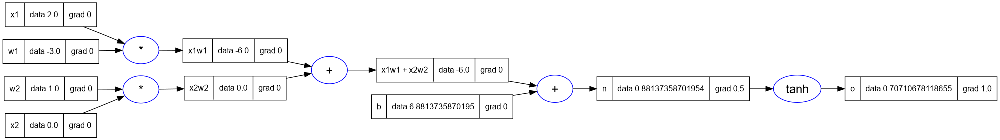

* Now let's call the `_backward` on `n` which is the next `Value` node going
  backward in the expression graph.
* And then we will call `_backward` on `b`, which if you notice is a leaf node.
* And then we will call `_backward` on `x1w1x2w2`, followed by `x1w1` and 
  `x2w2`.
* Let's make these calls and look at the results

```lua
n._backward()
b._backward()
x1w1x2w2._backward()
x1w1._backward()
x2w2._backward()

-- print the graph
trace_graph = require("util/trace_graph")
trace_graph.draw_dot_png(o, "plots/plot13-all_backprop.png")
```

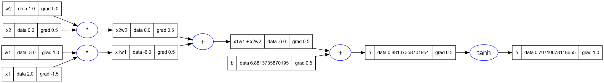

* Notice that the results are exactly as we had before in the manual back-
  propagation. But now we have done it through the automatic calcualation.


# 10. Part 8: Backpropagation for the entire expression graph

* When we do the backpropagation by calling the `_backward` function manually
  we're laying out the expression graph and calling the function starting from
  the output node and going left-wards (backwards) in the graph.
* And we cannot initial the backpropagation of the output node unless all the
  values in the expressions have been calculated upto the output node.
* All the dependencies of a node should have been calculated before we can
  call `_backward` on it.
* The way we achieve this by doing something called **Topological Sort**.
* **Topological Sort** is the laying out of a graph such that all the edges
  are going in one direction say left-to-right.
* Andrej suggests reading more about the topic, but simply provides an
  implementation for the sort in python.
* And here I've implemented the same code in lua.

```lua
Set = require('util/Set')
topo = {}
visited = Set.empty()

function build_topo(v)
  if not visited:contains(v) then
    visited:add(v)
    for _, child in ipairs(v._prev:items()) do
      build_topo(child)
    end
    table.insert(topo, v)
  end
end

build_topo(o)
for _, v in ipairs(topo) do print(v) end

-- Value(data = 2.0)
-- Value(data = -3.0)
-- Value(data = -6.0)
-- Value(data = 0.0)
-- Value(data = 1.0)
-- Value(data = 0.0)
-- Value(data = -6.0)
-- Value(data = 6.8813735870195)
-- Value(data = 0.88137358701954)
-- Value(data = 0.70710678118655)
```

* Now let's use the topological sort to do what we did manually.
* We will set the gradient of the output node as 1.
* Then we will call the `_backward` function on each Value node in the topo
  sort (but in the reverse order).

```lua
o.grad = 1
for i = #topo, 1, -1 do
    topo[i]._backward()
end

-- print the graph
trace_graph = require("util/trace_graph")
trace_graph.draw_dot_png(o, "plots/plot14-using_topo_sort.png")
```

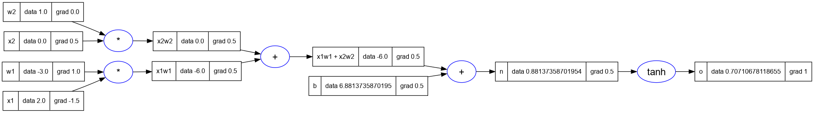

## 10.1. Implement the `backward` function in `Value` class

* Now we will move this `backward` function into the `Value` class like so...

```lua
--- implement the backpropagation for the Value
function Value:backward()
    local topo = {}
    local visited = Set.empty()

    local function build_topo(v)
      if not visited:contains(v) then
        visited:add(v)
        for _, child in ipairs(v._prev:items()) do
          build_topo(child)
        end
        table.insert(topo, v)
      end
    end

    build_topo(self)

    -- visit each node in the topological sort (in the reverse order)
    -- and call the _backward function on each Value
    self.grad = 1
    for i = #topo, 1, -1 do
        topo[i]._backward()
    end
end
```

* And finally we can just setup the neuron expression and call `o.backward` to
  get the gradients.

```lua
Value = require('nanograd/engine')

-- inputs x1, x2
x1 = Value(2.0); x1.label = 'x1'
x2 = Value(0.0); x2.label = 'x2'
-- weights w1, w2
w1 = Value(-3.0); w1.label = 'w1'
w2 = Value(1.0); w2.label = 'w2'
-- bias of the neuron
b = Value(6.8813735870195432); b.label = 'b'
x1w1 = x1 * w1; x1w1.label = 'x1w1'
x2w2 = x2 * w2; x2w2.label = 'x2w2'
x1w1x2w2 = x1w1 + x2w2; x1w1x2w2.label = 'x1w1 + x2w2'
n = x1w1x2w2 + b; n.label = 'n'
o = n:tanh(); o.label = 'o'

-- backpropagation
o:backward()

-- print the graph
trace_graph = require("util/trace_graph")
trace_graph.draw_dot_png(o, "plots/plot15-o_backprop_using_backward.png")

```

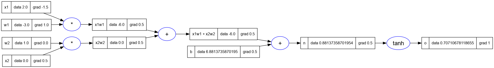

# 11. Part 9: Fixing backprop bug when using a node multiple times.

* We have a bug in the existing implemetation of backpropagation which only
  surfaces in certain cases.
* If we reuse the same node multiple times in the expression, it's gradient
  is calculated incorrectly.
* And this incorrect value is propagated through the rest of the graph.
* Here's an example of the bug.
  
```lua
Value = require('nanograd/engine')

a = Value(3.0); a.label = 'a'
b = a + a; b.label = 'b'
b:backward()

trace_graph = require("util/trace_graph")
trace_graph.draw_dot_png(b, "plots/plot16-backprop_bug_1.png")
```

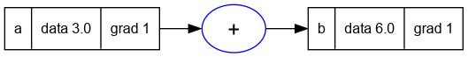

* There are two `a` nodes in the graph above but they are on top of another.
* And notice the gradients calculated for `a` and `b`.
* The grad for `b` is correctly set to 1.
* However since `b = f(a) = 2 * a`, therefore `f'(a) = db/da = 2`.
* But the grad of `a` is incorrectly marked 1.
* Now this occurs because of these two lines in the `_add` function of `Value`

```lua
  self.grad = 1 * out.grad
  other.grad = 1 * out.grad
```

* Even though in the case of `b = a + a`, both self and other are the same node,
  notice that their grads are overwritten by the two lines to 1.

## 11.1. A longer expression

* Lets use a longer more complicated expression to demonstrate the bug.

```lua
a = Value(-2.0); a.label = 'a'
b = Value(3.0); b.label = 'b'

d = a * b; d.label = 'd'
e = a + b; e.label = 'e'
f = d * e; f.label = 'f'

f:backward()

trace_graph.draw_dot_png(f, "plots/plot17-backprop_bug_2.png")
```

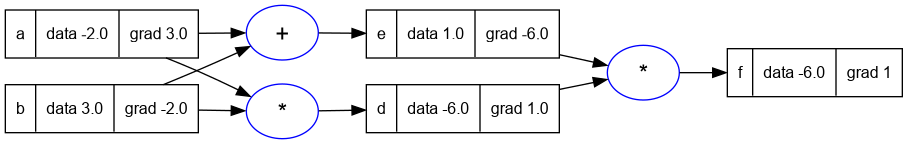

* You can see that the `a` and `b` nodes are used more than once in this
  expression.
* And this graph also has the same issue as the expression in the previous
  example.
* While backpropagating, we will visit `b` and `a` more than once, and each
  time their `grad` value will be overwritten. Thus resulting in incorrect
  values.

## 11.2. Solution for the bug

* We need to fix the overwriting of the gradients.
* See the ["Multivariable chain rule"][7], we need to accumulate the gradients
  using addition instead of replacing them.
* Therefore the solution to the bug is simple, we need to change the two lines
  which replace `self.grad` and `other.grad` to accumulate instead of replace
  values.

```lua
  self.grad = self.grad + (1 * out.grad)
  other.grad = other.grad + (1 * out.grad)
```

* We need to make these changes/fixes in every `_backward` internal function,
  and then we have the gradients accumulated correctly.

```lua
--- Declare the class Value
Value = class('Value')

--- static incrementing identifier
Value.static._next_id = 0

--- static method to get the next identifier
function Value.static.next_id()
    local next = Value.static._next_id
    Value.static._next_id = Value.static._next_id + 1
    return next
end

--- constructor
function Value:initialize(data, _children, _op, label)
    self.data = data
    self.grad = 0
    self._op = _op or ''
    self.label = label or ''
    self._backward = function() end
    self.id = Value.next_id()
    if _children == nil then
        self._prev = Set.empty()
    else
        self._prev = Set(_children)
    end
end

--- string representation of the Value object
function Value:__tostring()
    return 'Value(data = ' .. self.data .. ')'
end

--- add this Value object with another
-- using metamethod _add
function Value:__add(other)
    local out = Value(self.data + other.data, { self, other }, '+')
    local _backward = function()
        self.grad = self.grad + (1 * out.grad)
        other.grad = other.grad + (1 * out.grad)
    end
    out._backward = _backward
    return out
end

--- multiply this Value object with another
-- using metamethod _mul
function Value:__mul(other)
    local out = Value(self.data * other.data, { self, other }, '*')
    local _backward = function()
        self.grad = self.grad + (other.data * out.grad)
        other.grad = other.grad + (self.data * out.grad)
    end
    out._backward = _backward
    return out
end

--- implement the tanh function for the Value class
function Value:tanh()
    local x = self.data
    local t = (math.exp(2 * x) - 1) / (math.exp(2 * x) + 1)
    local out = Value(t, { self }, 'tanh')
    local _backward = function()
        self.grad = self.grad + ((1 - t * t) * out.grad)
    end
    out._backward = _backward
    return out
end

--- implement the backpropagation for the Value
function Value:backward()
    local topo = {}
    local visited = Set.empty()

    local function build_topo(v)
        if not visited:contains(v) then
            visited:add(v)
            for _, child in ipairs(v._prev:items()) do
                build_topo(child)
            end
            table.insert(topo, v)
        end
    end

    build_topo(self)

    -- visit each node in the topological sort (in the reverse order)
    -- and call the _backward function on each Value
    self.grad = 1
    for i = #topo, 1, -1 do
        topo[i]._backward()
    end
end
```

## 11.3. Examples fixed

* We can run the previous examples and see that the bug is now fixed.

```lua
Value = require('nanograd/engine')

a = Value(3.0); a.label = 'a'
b = a + a; b.label = 'b'
b:backward()

trace_graph = require("util/trace_graph")
trace_graph.draw_dot_png(b, "plots/plot18-fixed_example1.png")

```

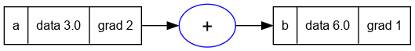

* We can see in the graph above that the gradient at `a` is now
  correctly set to `2`.
* Similarly for the longer expression in the previous section.

```lua
a = Value(-2.0); a.label = 'a'
b = Value(3.0); b.label = 'b'

d = a * b; d.label = 'd'
e = a + b; e.label = 'e'
f = d * e; f.label = 'f'

f:backward()

trace_graph.draw_dot_png(f, "plots/plot19-fixed_example2.png")
```

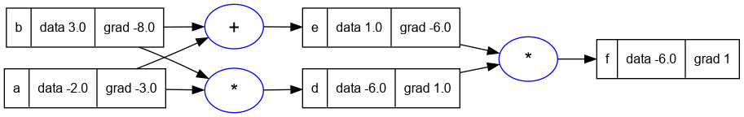

# 12. Part 10: Breaking up tanh: Adding more operations to `Value`

* In this part of the video Andrej goes on to implement more operations in
  the `Value` class.
* One of the goals is to expand the tanh function and implement its formula.
* This is a sort of repetition of the concepts considered in the previous
  sections and reinforces the learnings.
* The first operation we add support for is adding `Value` objects to constants.

## 12.1. Supporting constants in `Value.__add`

* Andrej adds support for this in the `__add__` metamethod using the check for
  the type of `other` using the `instanceof` operator.
* In lua I've implemented this slightly differently, by checking if the type
  of `other` is `number` and in that case creating a `Value`
* In lua the same method is used by the runtime, when the order of operations
  is reversed (solved in python using the `__rmul__` method).
* Therefore in lua I have to handle the additional situation when self is a
  `number`. To not pollute the global `self`, I've used a local `this` variable
  to create a new `Value` object when `self` is a `number`.

```lua
function Value:__add(other)
    local this = self
    if type(other) == 'number' then
        other = Value(other)
    end
    if type(self) == 'number' then
        this = Value(self)
    end

    local out = Value(this.data + other.data, { this, other }, '+')
    local _backward = function()
        this.grad = this.grad + (1 * out.grad)
        other.grad = other.grad + (1 * out.grad)
    end
    out._backward = _backward
    return out
end
```

* Once the above changes are done in the `Value` class we can write.

```lua
Value = require('nanograd/engine')

2 + Value(2)
-- Value(data = 4)

Value(2) + 2
-- Value(data = 4)

```

## 12.2. Adding support for exponentiation in `Value`

* We now add support for exponentiation in the `Value` class. This is required
  because one of the ways `tanh` can be implemented is by using the formula
  which expresses it in terms of the exponential function. See
  [Exponential Definitions of Hyperbolic Functions][8]

```lua

function Value:exp()
    local x = self.data
    local out = Value(math.exp(x), { self }, 'exp')
    local _backward = function()
        -- because the derivative of exp(x) is exp(x)
        -- and out.data = exp(x)
        self.grad = self.grad + (out.data * out.grad)
    end
    out._backward = _backward
    return out
end

```

* Here's an example of the exp function in a sample expression below.

```lua
Value = require('nanograd/engine')

a = Value(2.0)
a:exp()
-- Value(data = 7.3890560989307)
```

## 12.3. Adding support for division and subtraction

* Division and subtraction are the last two operations needed to be able to 
  express the tanh function using exponentiation.
* Andrej demonstrates how to implement division in a more general form.
* We take into consideration the fact that `a/b = a * 1/b = a * (b**-1)`.
* So we implement the `power` function which helps us implement division.

* First we implement subtraction in terms of negation, which is built upon
  multiplication with -1.

```lua
function Value:__unm()
    return self * -1
end

--- subtract this Value object with another
-- using metamethod _sub
function Value:__sub(other)
    return self + (-other)
end
```

* Here's an example

```lua
a = Value(2.0)
b = Value(4.0)
a - b
-- Value(data = -2.0)
```

* Here's how we implemented division using an implemetation of power.

```lua
function Value:__div(other)
    return self * other ^ -1
end

--- This is the power function for the Value class
-- using metamethod _pow
-- it does not support the case where the exponent is a Value
function Value:__pow(other)
    local this = self
    if type(other) ~= 'number' then
        error('Value:__pow: other must be a number')
    end

    if type(self) == 'number' then
        this = Value(self)
    end

    local out = Value(this.data ^ other, { this }, '^' .. other)
    local _backward = function()
        this.grad = this.grad
            + (other * (this.data ^ (other - 1)) * out.grad)
    end
    out._backward = _backward
    return out
end

```

## 12.4. Sample expression with tanh expanded

* Here's the expression with the tanh node expanded into its component parts.
  
```lua
Value = require('nanograd/engine')

-- inputs x1, x2
x1 = Value(2.0); x1.label = 'x1'
x2 = Value(0.0); x2.label = 'x2'
-- weights w1, w2
w1 = Value(-3.0); w1.label = 'w1'
w2 = Value(1.0); w2.label = 'w2'
-- bias of the neuron
b = Value(6.8813735870195432); b.label = 'b'
x1w1 = x1 * w1; x1w1.label = 'x1w1'
x2w2 = x2 * w2; x2w2.label = 'x2w2'
x1w1x2w2 = x1w1 + x2w2; x1w1x2w2.label = 'x1w1 + x2w2'
n = x1w1x2w2 + b; n.label = 'n'
e = (2 * n):exp(); e.label = 'e'
o = (e - 1)/(e + 1); o.label = 'o'

-- backpropagation
o:backward()

-- print the graph
trace_graph = require("util/trace_graph")
trace_graph.draw_dot_png(o, "plots/plot20-tanh_expanded.png")

```

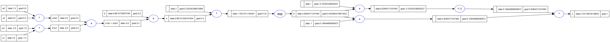

* The above graph agrees with the previous non-expanded version of the
  expression in the previous sections.
* This shows two things:
  * One: that these two expressions are equivalent
  * Two: that the granularity of functions supported in the `Value` node is
    entirely up to us.
* As long as we can do the forward pass and backward pass of an operation,
  it does not matter what the operation is.

# 13. Part 11: The same example in PyTorch

* In this section of the video Andrej goes over how the same expression is
  implemented in PyTorch.
* He also explains that micrograd is a very simplified version of the operations
  in PyTorch.
* This section of the video begins around 1H35M, and I will not repeat the whole
  thing here.
* An example of PyTorch usage is also provided in the [tests for micrograd][9].

# 14. Part 12: Building a neural net library (multi-layer perceptron)

* We have created a mechanism to create quite complex expression.
* And now we can use this mechanism to create neurons and then layers of
  neurons eventually leading up to neural networks.
* As neural networks are just a special class of mathematical expressions.
* So we will build a neural net piece by piece, and eventually we will build
  a 'two layer multi-layer perceptron'.
* Lets start with a single neuron.
* We will build a neuron that subscribes to the PyTorch API.
* Just like we matched the PyTorch API on the backprop side, we will try to do
  the same on the neural network.

```lua
class = require 'lib/middleclass'
Value = require 'nanograd/engine'

Neuron = class('Neuron')

--- constructor of a Neuron
-- @param nin number of inputs
function Neuron:initialize(nin)
    --- create a random number in the range [-1, 1]
    local function rand_float()
        return (math.random() - 0.5) * 2
    end

    -- create a table of random weights
    self.w = {}
    for _ = 1, nin do
        table.insert(self.w, Value(rand_float()))
    end

    -- create a random bias
    self.b = Value(rand_float())
end

--- forward pass of the Neuron
-- calculate the activation and then apply the activation function
-- which in our case is the tanh function
-- @param x input vector
function Neuron:__call(x)
    local act = self.b
    for i = 1, #self.w do
        act = act + self.w[i] * x[i]
    end
    local out = act:tanh()
    return out
end

x = {2.0, 3.0}
n = Neuron(2)
n(x)
-- Expected output: A Value object with value in the range [-1, 1]
```

## 14.1. Multi-layer perceptron

* Andrej again refers to the schematic of the mlp (multi-layered perceptron)
  from the course page of CS231n.
* He talks about hidden layer 1, and how there are several neurons in the layer
  and they are not connected to each other but they are fully connected to the
  inputs.


* So what is a layer of neurons, it's just a set of neurons evaluated
  independently.

```lua
Layer = class('Layer')

--- constructor of a Layer
-- @param nin number of inputs
-- @param nout number of outputs
function Layer:initialize(nin, nout)
    self.neurons = {}
    for _ = 1, nout do
        table.insert(self.neurons, Neuron(nin))
    end
end

--- forward pass of the Layer
-- @param x input vector
function Layer:__call(x)
    local outs = {}
    for _, neuron in ipairs(self.neurons) do
        table.insert(outs, neuron(x))
    end
    return outs
end

n = Layer(2, 3)
x = { Value(1), Value(2) }
y = n(x)
for _, v in ipairs(y) do
    print(v)
end
-- Expected output: A table of Value objects with value in the range [-1, 1]

```

## 14.2. Complete MLP

* Finally we complete the picture shown above and create a complete multi-
  -layer perceptron aka MLP.
* The multi-layer perceptron takes a number of inputs, and a list of numbers
  signifying the number of neurons in each layer.
* Below we try to replicate the sample mlp in the picture at the beginning of
  this section by create an mlp with 3 inputs, and 2 layers of 4 neurons each,
  and 1 output.

```lua
MLP = class('MLP')

--- constructor of a Multi-Layer Perceptron
function MLP:initialize(nin, nouts)
    local sz = table.pack(nin, table.unpack(nouts))
    self.layers = {}
    for i = 1, #nouts do
        table.insert(self.layers, Layer(sz[i], sz[i + 1]))
    end
end

--- forward pass of the MLP
-- @param x input vector
function MLP:__call(x)
    local out = x
    for _, layer in ipairs(self.layers) do
        out = layer(out)
    end
    return out
end

x = {2, 3, -1}
mlp = MLP(3, { 4, 4, 1 })
y = mlp(x)
for _, v in ipairs(y) do
    print(v)
end
-- Value(data = 0.31997025487794)
-- Expected output: A table of 1 Value object with value in the range [-1, 1]
```

* To make the above tabular output a little nicer, we make a change in
  `Layer.__call` to return only the first element if the number of outputs is
  exactly one.
* This helps us directly print out the result as one value instead of indexing
  it in a table whose length we know is 1.

```lua
--- forward pass of the Layer
-- @param x input vector
function Layer:__call(x)
    local outs = {}
    for _, neuron in ipairs(self.neurons) do
        table.insert(outs, neuron(x))
    end
    if #outs == 1 then
        return outs[1]
    end
    return outs
end

```

* And now to use it

```lua
nn = require('nanograd/nn')

x = {2, 3, -1}
n = nn.MLP(3, { 4, 4, 1 })
y = n(x)
y
-- Value(data = 0.21260160250202
-- Expected a value with value in range [-1, 1]
```

* We can plot the expression for the MLP, and you can see that the graph is
  quite complicated and large.
* "Open the image in a new window/top" and zoom-in to see the details.
* And we will be able to backpropagate through the expression using our
  backpropagation implementation.

```lua
trace_graph = require("util/trace_graph")
trace_graph.draw_dot_png(y, "plots/plot21-mlp.png")

```

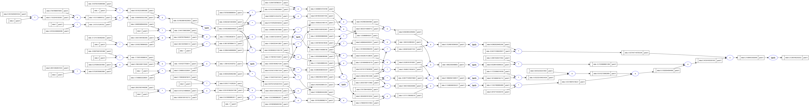

# 15. Part 13: Working with a tiny dataset, writing a loss function

* We will start with a small example dataset created by Andrej.
* This dataset has four sets of 3 inputs each.
* And it also had the desired output for each of the four input sets.
* The expected output for `xs[1]` is `ys[1]` and so on.
* *Lua Note:* Array indexes in Lua are 1-based.
* This is basically a very simple binary classifier neural network that we
  would like to build here.

```lua
xs = {
  {2.0, 3.0, -1.0},
  {3.0, -1.0, 0.5},
  {0.5, 1.0, 1.0},
  {1.0, 1.0, -1.0},
}

ys = {1.0, -1.0, -1.0, 1.0} -- desired targets

```

* Let's see what values our neural network creates for these inputsAnd in
* We will create a set of neurons for each input set

```lua
-- get the predictions from our neural network
ypred = {}
for _, x in ipairs(xs) do
  table.insert(ypred, n(x))
end

-- print the predictions
for _, yval in ipairs(ypred) do
  print(yval)
end

-- Value(data = -0.2125230539818)
-- Value(data = -0.74155205138326)
-- Value(data = -0.11718987980605)
-- Value(data = -0.56119517054583)
```

* Notice that the values we get aren't the ones that we want.
* So how do we *tune* the neural net, how to set the weights to better predict
  the expected values.
* The trick used in deep learning is to calculate a single number which 
  represents the performance of your entire neural network.
* We call this single number the **loss**.
* The **loss** is defined in such a way as to measure close we are to the
  expected values.
* And in our case we notice that the output values are quite far apart from
  th expected values so the **loss** is going to be *high*.
* So particularly in this example we're going to implement the **Mean-squared**
  **error** loss function.
* Lets calculate the squared-difference of each expected output and calculated
  output.
* The difference is small when the predicted output is close to the expected one
  and higher when it is not.
* Squaring the difference ensures that we are removing the sign of the
  difference, as we are only interested in the magnitude of the difference.
* We could also have taken an absolute value instead of a square.

```lua
for idx, ygt in ipairs(ys) do
  local yout = ypred[idx]
  local diff_sq = (yout - ygt) ^ 2
  print(diff_sq)
end

-- Value(data = 1.4702121564374)
-- Value(data = 0.0667953421442)
-- Value(data = 0.77935370831686)
-- Value(data = 2.4373303605356)
```

* The final loss is just the sum of all these squared difference values.

```lua
loss = 0
for idx, ygt in ipairs(ys) do
  local yout = ypred[idx]
  local diff_sq = (yout - ygt) ^ 2
  loss = loss + diff_sq
end
loss
-- Value(data = 4.753691567434)
```

* And now we want to minimize the loss.
* Because if the loss is low then all the predictions are equal or close to
  their targets.
* Lowest value for the loss is zero, and the greater it is the worse is the
  neural net's prediction.
* Now we can call `loss.backward()`.

```lua
loss:backward()
```

* And then we can look at the gradient of the weight of one of the neurons.

```lua
n.layers[1].neurons[1].w[1].grad

-- -0.24412389856678
```

* We see that the gradient 1st weight of the 1st neuron in the 1st layer is
  negative.
* This means that we increase the weight in some way then the output will
  decrease, and if we decrease it the output will increase.
* And we have this information for all the neurons in our neural network.
* We can now look at the graph of the loss, and it is a really massive graph
  as it the loss expression is the sum of square differences of prediction
  and value from the calling the same neural network expression 4 times.
* Therefore it has four forward passes of the neural network.
* And this loss is then backpropagated through all the neurons of the network,
  impacting every weight in the network.
* There are gradients even on the input data, but the gradients on the input
  data are not that useful to us. Because we cannot change the inputs.
* The gradients on the neuron weights are quite useful, because we can change
  these values.

```lua
trace_graph = require("util/trace_graph")
trace_graph.draw_dot_png(loss, "plots/plot22-loss_fn.png")
```


# 16. Part 14: Collecting the parameters of the neural net

* Now we would like to collect all the parameters of the neural network which
  can be changed.
* We can use this information to improve the prediction of our neural network.
* We will take each parameter, and use its gradient information to slighly
  **nudge** it in the proper direction, thus improving our prediction slightly.
* Lets first implement a `parameters` function on the Neuron, Layer and MLP
  so that we can get the parameters at each level of abstraction.
* Andrej explains that the PyTorch API has a similar method at each module to
  get the parameters of the neural network. In PyTorch the parameters contain
  tensors, in our case they consist of scalars.
* The following three methods are added to the three classes in our `nn` module.

```lua
--- get the parameters of the Neuron
function Neuron:parameters()
    local params = {}
    for _, w in ipairs(self.w) do
        table.insert(params, w)
    end
    table.insert(params, self.b)
    return params
end

--- get the parameters of the Layer
function Layer:parameters()
    local params = {}
    for _, neuron in ipairs(self.neurons) do
        for _, p in ipairs(neuron:parameters()) do
            table.insert(params, p)
        end
    end
    return params
end

--- get the parameters of the MLP
function MLP:parameters()
    local params = {}
    for _, layer in ipairs(self.layers) do
        for _, p in ipairs(layer:parameters()) do
            table.insert(params, p)
        end
    end
    return params
end
```  

* Since we have added functionality to the library classes, we will have to
  re-initialize the network, which will mean that the numbers from the previous
  sections will change.
* But lets re-create the network and get the parameter.
* We will use the same inputs and expected outputs as before.

```lua
nn = require('nanograd/nn')

x = {2, 3, -1}
n = nn.MLP(3, { 4, 4, 1 })
y = n(x)
params = n:parameters()
for _, p in ipairs(params) do
  print(p)
end

-- Value(data = 0.89947108740256)
-- Value(data = 0.21710691494644)
-- Value(data = -0.2568461254886)
-- Value(data = -0.49265812862045)
-- Value(data = 0.12414315431987)
-- Value(data = 0.94707373819403)
-- Value(data = 0.63404890788629)
-- Value(data = 0.42185675500494)
-- Value(data = 0.0089102760436)
-- Value(data = 0.58044623302781)
-- Value(data = -0.86929071148439)
-- Value(data = 0.15575208693409)
-- Value(data = 0.44288573669835)
-- Value(data = 0.4667738499158)
-- Value(data = -0.98407767069638)
-- Value(data = -0.14693628572282)
-- Value(data = 0.39951610093775)
-- Value(data = 0.44764131141769)
-- Value(data = 0.03944588338849)
-- Value(data = 0.7494742957424)
-- Value(data = 0.71090438564231)
-- Value(data = -0.74601199565492)
-- Value(data = -0.25752269338228)
-- Value(data = -0.90957262177433)
-- Value(data = 0.0359006962453)
-- Value(data = -0.080902850065914)
-- Value(data = 0.96416457202521)
-- Value(data = 0.23499143701794)
-- Value(data = 0.24300516537216)
-- Value(data = 0.32503985553126)
-- Value(data = -0.35125740109367)
-- Value(data = -0.99598507893982)
-- Value(data = 0.51356883398199)
-- Value(data = -0.87182971744332)
-- Value(data = -0.59188237397656)
-- Value(data = -0.42479770662424)
-- Value(data = 0.91480448125106)
-- Value(data = -0.9121852924116)
-- Value(data = 0.57555963689187)
-- Value(data = -0.3616257041031)
-- Value(data = -0.70890243621625)
```

* Those are all the parameters of the neural network.
* In total there are 41 parameters in the network. 

```lua
#params
-- 41
```

# 17. Part 15: Manual gradient descent to train the network

* Now we can recalculate the predictions, and also recalculate the loss.

```lua
xs = {
  {2.0, 3.0, -1.0},
  {3.0, -1.0, 0.5},
  {0.5, 1.0, 1.0},
  {1.0, 1.0, -1.0},
}

ys = {1.0, -1.0, -1.0, 1.0} -- desired targets

-- get the predictions from our neural network
ypred = {}
for _, x in ipairs(xs) do
  table.insert(ypred, n(x))
end

-- print the predictions
for _, yval in ipairs(ypred) do
  print(yval)
end

-- Value(data = 0.95846078164411)
-- Value(data = 0.65318359523669)
-- Value(data = -0.3159095385672)
-- Value(data = 0.9479771814826)

loss = 0
for idx, ygt in ipairs(ys) do
  local yout = ypred[idx]
  local diff_sq = (yout - ygt) ^ 2
  loss = loss + diff_sq
end
loss
-- Value(data = 3.2054276392912)

loss:backward()
```

* Lets look at one of the neurons in the network

```lua
n.layers[1].neurons[1].w[1].grad
-- 1.7179419965102
n.layers[1].neurons[1].w[1].data
-- 0.89947108740256
```

## 17.1. Changing the parameters

* What we want to do is iterate through the parameters, and update the data
  of each parameter according to its gradient.
* Each of these changes will be a *tiny update* in this gradient descent scheme.
* In **gradient descent** we're thinking of the gradient as a *vector pointing*
  *in the direction of increased loss*.
* And thus the tiny nudge in a parameter's data should be in the opposite
  direction of the gradient, if we want to *minimize the loss*.
* So we will increase the data if gradient is negative, and decrease it if the
  gradient is positive.
* This will help us minimize the loss.

```lua
for _, p in ipairs(n:parameters()) do
  p.data = p.data + (-0.01 * p.grad)
end
```

* If we look at the neuron we looked at in the previous section we see that
  its data is decreased by a tiny amount, as the grad was positive.

```lua
n.layers[1].neurons[1].w[1].data
-- 0.88229166743745
```

* Now lets redo the forward pass and recaluculate our loss, to compare if
  the loss has really gone down.

```lua
-- get the predictions from our neural network
ypred = {}
for _, x in ipairs(xs) do
  table.insert(ypred, n(x))
end

-- print the predictions
for _, yval in ipairs(ypred) do
  print(yval)
end

-- Value(data = 0.9515274948404)
-- Value(data = 0.46169799654315)
-- Value(data = -0.56459976791272)
-- Value(data = 0.93800864943225)

loss = 0
for idx, ygt in ipairs(ys) do
  local yout = ypred[idx]
  local diff_sq = (yout - ygt) ^ 2
  loss = loss + diff_sq
end
loss
-- Value(data = 2.3323269065016)
```

* We can see that the value of *loss* has reduced.
* Remember that we created *loss* such that a lower loss means that the
  predictions are closer to the actual output (or y) values.
* And now all we have to do is to iterate this process.
* We can now call `loss.backward()` and then rerun the gradient descent by
  changing the parameters and calculate the loss, and we will have even lower
  loss.

```lua
for i = 1, 10, 1 do
  for _, p in ipairs(n:parameters()) do
    p.data = p.data + (-0.01 * p.grad)
  end

  ypred = {}
  for _, x in ipairs(xs) do
    table.insert(ypred, n(x))
  end

  loss = 0
  for idx, ygt in ipairs(ys) do
    local yout = ypred[idx]
    local diff_sq = (yout - ygt) ^ 2
    loss = loss + diff_sq
  end
  print(loss)

  loss:backward()
end

-- After repeating the above a few times
-- Value(data = 0.12040247627763)
-- Value(data = 0.062943226742918)
-- Value(data = 0.031032400220314)
-- Value(data = 0.014858863401187)
-- Value(data = 0.0070343726399085)
```

* We can also try the above loop with an increased step size when *nudging* the
  parameters.
* This can help us get to a lower loss value faster with fewer iterations.
* However since we do not know the shape of the loss function, with a large step
  size we can overshoot a local minima and end up spending more time getting
  to an acceptable loss, and using up more iterations.
* Thus a higher step size can destabilize training.

```lua
for _, y in ipairs(ypred) do
  print(y)
end
-- Value(data = 0.95485405874161)
-- Value(data = -0.99275523185195)
-- Value(data = -0.99791606900258)
-- Value(data = 0.92971922600112)
```  

* We can also see that the predictions have come quite close to the expected
  output values which were {1, -1, -1, 1}
* Usually the *learning rate* and its *tuning* is a **subtle art**.
* With a slow *learning rate* you might take too much time, but with a higher
  one the learning can become unstable and you might not necessarily reduce
  the loss.
* now the values in `n.parameters()` represent our parameters for a trained
  neural network.
* And we have successfully trained a neural network manually.

## 17.2. Convert our manual steps into a loop

* I've already done some of this in the previous step, but we will follow
  Andrej and reimplement the training as a loop over the forward pass, backward
  pass and the gradient descent.
* And this time we will also start with a fresh initialization of the neural
  network.

```lua
nn = require('nanograd/nn')

-- create the neural network
x = {2, 3, -1}
n = nn.MLP(3, { 4, 4, 1 })
y = n(x)

-- setup the input and output data
xs = {
  {2.0, 3.0, -1.0},
  {3.0, -1.0, 0.5},
  {0.5, 1.0, 1.0},
  {1.0, 1.0, -1.0},
}

ys = {1.0, -1.0, -1.0, 1.0} -- desired targets

-- training step, with 20 steps and 0.05 step size
for k = 1, 20, 1 do
  -- forward pass
   ypred = {}
  for _, x in ipairs(xs) do
    table.insert(ypred, n(x))
  end

  loss = 0
  for idx, ygt in ipairs(ys) do
    local yout = ypred[idx]
    local diff_sq = (yout - ygt) ^ 2
    loss = loss + diff_sq
  end

  -- backward pass
  loss:backward()

  -- update
  for _, p in ipairs(n:parameters()) do
    p.data = p.data + (-0.05 * p.grad)
  end

  print(k, loss.data)
end

-- a sample run
-- 1       8.948223142018
-- 2       5.6293444074632
-- 3       2.3747899826466
-- 4       1.1305574554506
-- 5       0.32438208407916
-- 6       0.01127065361211
-- 7       0.001092566984279
-- 8       0.00017517554507502
-- 9       4.2222575600352e-05
-- 10      1.4604597369626e-05
-- 11      7.0620246480703e-06
-- 12      4.670629236246e-06
-- 13      4.070696694394e-06
-- 14      4.4236130445702e-06
-- 15      5.6055300153419e-06
-- 16      7.7314608834729e-06
-- 17      1.0909389649905e-05
-- 18      1.4992666354178e-05
-- 19      1.939669241198e-05
-- 20      2.3173729333138e-05
```

* You can see that we converge very fast to a very low loss.
* `ypred` should now be very good.

```lua
for _, y in ipairs(ypred) do
  print(y)
end
-- Value(data = 1.0)
-- Value(data = -0.99519773140024)
-- Value(data = -0.99966541723159)
-- Value(data = 1.0)
```

## 17.3. Fixing a **bug** in the training

* Andrej explains that he has a major **bug** in the previous process.
* And it is a common bug, that he has tweeted about it before.
* TODO: find the tweet and insert it here - it is referenced at 2:11:20 of the
  video.
* The bug is that in the parameter update process in the training, we update
  the data but we don't *flush* the gradient it stays there.
* And so the subsequent backward pass is not starting with reset gradients,
  but from computed gradients for the previous backward pass, which starts
  accumulating errors in the gradient.
* We need to go to the forward pass step, and go over all all the parameters
  and set their gradients to 0 before we do the backward pass.

```lua
nn = require('nanograd/nn')

-- create the neural network
x = {2, 3, -1}
n = nn.MLP(3, { 4, 4, 1 })
y = n(x)

-- setup the input and output data
xs = {
  {2.0, 3.0, -1.0},
  {3.0, -1.0, 0.5},
  {0.5, 1.0, 1.0},
  {1.0, 1.0, -1.0},
}

ys = {1.0, -1.0, -1.0, 1.0} -- desired targets

-- training step, with 20 steps and 0.05 step size
for k = 1, 20, 1 do
  -- forward pass
   ypred = {}
  for _, x in ipairs(xs) do
    table.insert(ypred, n(x))
  end

  loss = 0
  for idx, ygt in ipairs(ys) do
    local yout = ypred[idx]
    local diff_sq = (yout - ygt) ^ 2
    loss = loss + diff_sq
  end

  -- BUGFIX
  -- zero grad
  for _, p in ipairs(n:parameters()) do
    p.grad = 0.0
  end

  -- backward pass
  loss:backward()

  -- update
  for _, p in ipairs(n:parameters()) do
    p.data = p.data + (-0.05 * p.grad)
  end

  print(k, loss.data)
end

-- sample run
-- 1       6.5107018704825
-- 2       3.1126005724299
-- 3       2.4938825913187
-- 4       1.7883930573954
-- 5       1.2408403651583
-- 6       0.79327624737986
-- 7       0.6255781249874
-- 8       0.53704169336572
-- 9       0.47040794696311
-- 10      0.41668536261753
-- 11      0.37251264940738
-- 12      0.33558241819608
-- 13      0.30426434323535
-- 14      0.27737926211604
-- 15      0.25405593621082
-- 16      0.23363804467625
-- 17      0.21562241567462
-- 18      0.1996171136397
-- 19      0.18531241921525
-- 20      0.17246035336327
```

* You can see that we now have a much slower descent, but we still end up with
  a pretty decent loss.
* We can get better and better results if we repeat the above iteration more
  and more times.
* The only reason the previous trainings worked is that the sample we used is
  a very simple problem, and it is *easy* for this neural net to fit this data.
  * The grads ended up accumulating, and it gave a massive step size, which
    helped us converge very fast onto the correct predictions.
* *WARNING:* working with neural networks can be tricky because the code might
  have bugs but the network might work just like the previous one worked. But
  if we have larger problems, then the neural network might not optimize well.

# 18. Summary of the Lecture

# 19. References

[1]: https://www.youtube.com/watch?v=VMj-3S1tku0
[2]: https://en.wikipedia.org/wiki/Differentiation_rules
[3]: https://github.com/kikito/middleclass
[4]: https://www.lua.org/pil/11.5.html
[5]: https://en.wikipedia.org/wiki/Chain_rule#Intuitive_explanation
[6]: https://cs231n.github.io/neural-networks-1/#bio
[7]: https://en.wikipedia.org/wiki/Chain_rule#Multivariable_case
[8]: https://en.wikipedia.org/wiki/Hyperbolic_functions#Exponential_definitions
[9]: https://github.com/karpathy/micrograd/blob/c911406e5ace8742e5841a7e0df113ecb5d54685/test/test_engine.py

# 20. Appendix
