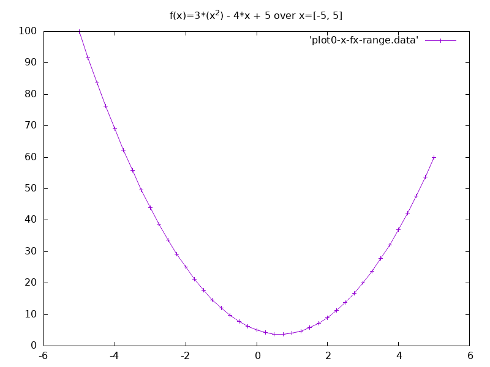
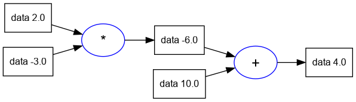
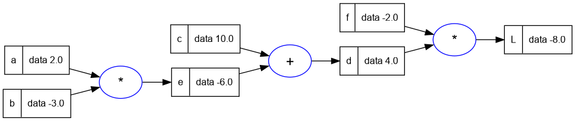
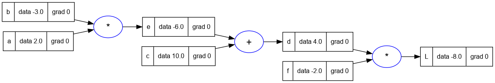
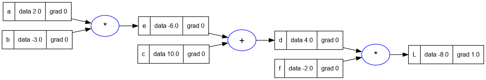
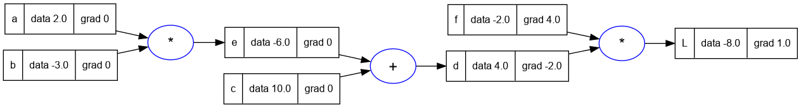
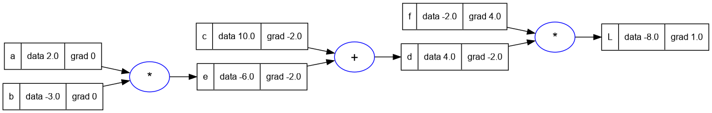
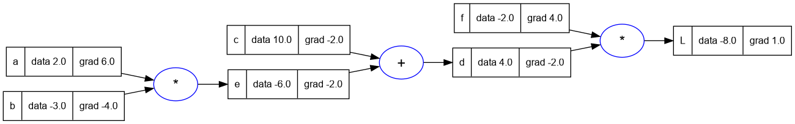
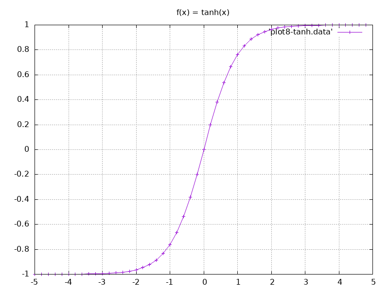
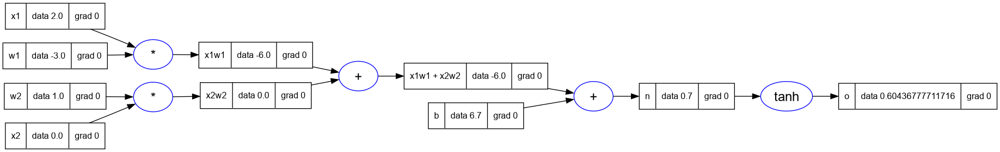

<h1>Notes from Andrej Karpathy's building micrograd video.</h1>
<p>
Date: 13/02/2024
Abhishek Mishra
</p>

<hr/>

**Table of Contents**

- [1. About these Notes](#1-about-these-notes)
- [2. Part 0: micrograd overview](#2-part-0-micrograd-overview)
  - [2.1. Neural Networks](#21-neural-networks)
- [3. Part 1: Derivative of a simple function with one input](#3-part-1-derivative-of-a-simple-function-with-one-input)
  - [3.1. Derivative of the Expression](#31-derivative-of-the-expression)
  - [3.2. Derivative at Another Point (x = -3)](#32-derivative-at-another-point-x---3)
  - [3.3. Derivative goes to 0](#33-derivative-goes-to-0)
- [4. Part 2: A More Complex Case](#4-part-2-a-more-complex-case)
- [5. Part 3: Expressions for Neural Networks](#5-part-3-expressions-for-neural-networks)
  - [5.1. Core Value Object](#51-core-value-object)
  - [5.2. Addition of Value Objects](#52-addition-of-value-objects)
  - [5.3. Multiplication of Value Objects](#53-multiplication-of-value-objects)
  - [5.4. Children of Value Objects](#54-children-of-value-objects)
  - [5.5. Storing the Operation](#55-storing-the-operation)
  - [5.6. Visualizing the Expression Graph](#56-visualizing-the-expression-graph)
  - [5.7. Label for Each Value Node in the Graph](#57-label-for-each-value-node-in-the-graph)
  - [5.8. Recap so far](#58-recap-so-far)
- [6. Part 4: Manual Back-propagation of an Expression](#6-part-4-manual-back-propagation-of-an-expression)
- [7. Part 5: Single Optimization Step: Nudge Inputs to Change Loss](#7-part-5-single-optimization-step-nudge-inputs-to-change-loss)
- [8. Part 6: Manual Back-propagation of a Single Neuron](#8-part-6-manual-back-propagation-of-a-single-neuron)
  - [8.1. The tanh function](#81-the-tanh-function)
  - [tanh support in Value class](#tanh-support-in-value-class)
  - [Expression for a Neuron](#expression-for-a-neuron)
- [9. References](#9-references)
- [10. Appendix](#10-appendix)

# 1. About these Notes

Recently I came across Andrej Karpathy's 
["building micrograd" video on youtube][1], after reading a mention of it on 
hackernews perhaps 🤔 (not sure).

I watched the whole video first. Then I was so intrigued I decided to implement
the same engine in a language which is *not python*, so that I can work through
the development of the engine and get it working and also test the results with 
Andrej's version.

In the second pass I watched the video and took notes about what Andrej was
explaining as well as about the python code.

In the third and later passes I slowly implemented the code for each section
and added the code and the results back to this document.


# 2. Part 0: micrograd overview

In this section of tutorial, Andrej provides an overview of micrograd. It is
an autograd engine. It implments backpropagation (reverse mode autodiff) over
a dynamically built DAG.
It is also a small neural networks library with a PyTorch-like API
Micrograd basically allows you to build out mathematical expressions,
and he shows us an example (from the README.md of micrograd).

The library builds an expression and through a forward pass calculates
the value of the expression. It then uses backpropagation to calculate
the gradients of the expression with respect to the input variables.

## 2.1. Neural Networks
Are just mathematical expressions
Take the weights of the neural network and input data as input, and produce
and output.
backpropagation is more general than neural networks, it works with any
mathematical expression.
Finally, micrograd is built using scalars, which is inefficient, but
simplifies the implmentation and allows us to understand the backpropagation 
and the chain rule.
When we want to train a larger network we should be using Tensors.
Andrej's claim is that micrograd is complete. It has only two files engine.py
which knows nothing about neural networks, and nn.py which is a neural
network library built on top of engine.py.
engine.py is literally 100 lines of code in Python. And nn.py is just 60
lines and is a total joke (sic).

* There's a lot to efficiency, but you can get to a working neural network all
  in less than 200 lines of code.

# 3. Part 1: Derivative of a simple function with one input

* Lets get a very good intuitive understanding of what a derivative is.
* Lets define a scalar valued function f(x), and get its value.

```lua
function f(x)
    return (3*(x^2)) - (4*x) + 5
end

f(3.0)
-- 20.0
```

* We can also plot this function over a range of values.

```lua
for x = -5,5,0.25 do
    print(x, f(x))
end

-- values plot given below
```



## 3.1. Derivative of the Expression
* Now we will think about the derivative of the expression.
* See the [Differentiation rules][2]
* In neural networks no one actually writes an expression and derives it.
* We are not going for the symbolic approach.
* We will try and understand what the derivative is measuring and what it is
  telling us about the function.
* We look at the definition of the derivative in terms of Limit from the wiki
  page of derivative.
TODO: update the definition of derivative here.
* Basically how does the function respond to an infinitesimal change in the
  input variable. What is the slope of the function at the point.

```lua
-- if we use too small h, we will eventuall get an incorrect value because
-- we are using floating point arithmetic.
h = 0.00001
x = 3.0

f(x+h)
-- 20.014003

(f(x+h) - f(x))/h
-- 14.003000000002
```

* From the above we can conclude that at x=3 the slope of f(x) is 14.
* We can also calculate using the derivative of f(x).
* f'(x) or df(x)/dx = 6*x - 4
* Therefore f'(x) at x = 3 is 14.

## 3.2. Derivative at Another Point (x = -3)

* Let's calculate slope at another point, say x = -3
* Even looking at the plot we can see that the slope of the function at x = -3
  is negative. Therefore the sign of the slope will be 'minus'.
* Slope or f'(-3) is -22.

```lua
x = -3

(f(x+h) - f(x))/h
-- -21.999970000053
```

## 3.3. Derivative goes to 0

* At x=2/3, the function's slope is 0.
* So the function will not respond to a nudge at this point.

```lua
x = 2/3

(f(x+h) - f(x))/h
-- 3.0000002482211e-05
```

# 4. Part 2: A More Complex Case

* Let's take a function with more than one inputs.
* We consider a function with three scalar inputs - a, b, c with a single output
  d.

```lua
a = 2.0
b = -3.0
c = 10.0

d = a*b + c

d
-- 4.0
```

* Now we would like to get the derivative of d w.r.t a, b and c.
* We would like to get the intuition of what this will look like.
* Lets start with derivative with respect to a. This means we will change a by
  a small amount and calculate d. And then we will calculate slope at the point.
* The value of d reduces by a small amount when we increase h by a small amount,
  as a is multiplied by b in the expression, and b is negative. Thus increase
  in a decreases the value of d.
* This gives us an intuition about the slope of d with respect to a.
* Note that using rules of differentiation also we will get the same answer
  as the calculation below.
* d(d)/da = b; therefore slope is b = -3.0

```lua
h = 0.00001
a = 2.0
b = -3.0
c = 10.0

d1 = a*b + c

a = a + h

d2 = a*b + c

print('d1 = ' .. d1)
-- d1 = 4.0
print('d2 = ' .. d2)
-- d2 = 3.99997
print('slope = ' .. (d2 - d1)/h)
-- slope = -3.0000000000641
```

* Now lets consider the derivative of d w.r.t. b.
* Again from the rules of differentiation d(d)/db = a.
* Therefore we should expect the answer 2.0.

```lua
h = 0.00001
a = 2.0
b = -3.0
c = 10.0

d1 = a*b + c

b = b + h

d2 = a*b + c

print('d1 = ' .. d1)
-- d1 = 4.0
print('d2 = ' .. d2)
-- d2 = 4.00002
print('slope = ' .. (d2 - d1)/h)
-- slope = 2.0000000000131
```

* Finally lets consider the derivative of d w.r.t. c.
* From the rules of differentiation d(d)/dc = 1.
* With changes in c, d changes by the exact same amount.

```lua
h = 0.00001
a = 2.0
b = -3.0
c = 10.0

d1 = a*b + c

c = c + h

d2 = a*b + c

print('d1 = ' .. d1)
-- d1 = 4.0
print('d2 = ' .. d2)
-- d2 = 4.00001
print('slope = ' .. (d2 - d1)/h)
-- slope = 0.99999999996214
```

* We have some intuitions about how expressions and their derivatives will work.
* Lets move to neural networks which will have massive expressions.

# 5. Part 3: Expressions for Neural Networks

As mentioned neural networks will have massive expressions. So we need some
datastructure to maintain the massive expressions. And so we will build out the
`Value` object which was shown in the beginning of the video, from the README
of the micrograd project.

## 5.1. Core Value Object

* Lets start with the skeleton of a very simple value object.
* *Lua Note:* Lua is object-oriented but does not have classes. To keep the
  structure of the code similar to the one in the video,
  we will write the classes using the excellent [*middleclass*][3] library.
    - The code will be slightly more verbose than python.
* Here we create a simple value class, then create an instance `a`, and
  finally print it out.
* *Lua Note:* To make sure the code can be run in an interpreter, all Lua
  variables are being created in global scope. Usually we would write the code
  in files, and make sure that the variables are marked `local`.

```lua
class = require 'lib/middleclass'

-- Declare the class Value
Value = class('Value') -- 'Value' is the class' name

-- constructor
function Value:initialize(data)
  self.data = data
end

-- tostring
function Value:__tostring()
  return 'Value(data = ' .. self.data .. ')'
end

a = Value(2.0)

a
-- Value(data = 2.0)
```

## 5.2. Addition of Value Objects

* Now, we would like to create mutliple values and also be able to do things
like `a + b` where `a` and `b` are values.
* We're going to use the metamethod `__add` in Lua to allow us to define 
  addtion for Value objects.
* The addition inside `Value:__add` is a simple floating point addition of the
  data of two Value objects.

```lua
class = require 'lib/middleclass'

function Value:initialize(data)
  self.data = data
end

function Value:__tostring()
  return 'Value(data = ' .. self.data .. ')'
end

-- add this Value object with another
-- using metamethod _add
function Value:__add(other)
  return Value(self.data + other.data)
end

a = Value(2.0)
b = Value(-3.0)

-- this line will invoke the metamethod Value:__add
a + b
-- Value(data = -1.0)

```

## 5.3. Multiplication of Value Objects

* Multiplication of Value objects is fairly simple and uses the `__mul`
  metamethod.
* This will now help us write expressions like `a * b` and `a * b + c`.

```lua
-- Class definition same as in the previous snippet.
-- multiply this Value object with another
-- using metamethod _mul
function Value:__mul(other)
  return Value(self.data * other.data)
end

a = Value(2.0)
b = Value(-3.0)
c = Value(10.0)

a * b
-- Value(data = -6.0)

-- the next line is equivalent to
-- (a.__mul(b)).__add(c)
d = a * b + c

d
--Value(data = 4.0)
```

## 5.4. Children of Value Objects

* What we're missing is the connective tissue of the expression.
* We want to keep these expression graphs, so we need to keep pointers about
  what values produce what other values.
* So we're going to introduce a new variable called `_children` which will be
  by default an empty tuple.
* *Lua Note:* Lua does not have tuples. In fact it has only one in-built
  compound datatype **tables**. So we're going to use a table to store
  `_children`.
* Internally the `children` are stored as **set** for efficiency.
* *Lua Note:* Lua does not have sets either. However sets can be eumulated in
  Lua using tables by keeping the elements as *indices* of a table. See 
  [11.5 – Sets and Bags (Programming in Lua)][4] for details of this approach.

```lua
class = require 'lib/middleclass'
Set = require 'util/set'

Value = class('Value')

function Value:initialize(data, _children)
  self.data = data
  if _children == nil then
    self._prev = Set.empty()
  else
    self._prev = Set(_children)
  end
end

function Value:__tostring()
  return 'Value(data = ' .. self.data .. ')'
end

function Value:__add(other)
  return Value(self.data + other.data, {self, other})
end

function Value:__mul(other)
  return Value(self.data * other.data, {self, other})
end

a = Value(2.0)
b = Value(-3.0)
c = Value(10.0)

d = a * b + c

d._prev
-- {Value(data = -6.0), Value(data = 10.0)}

```

## 5.5. Storing the Operation

* In addition to the children for a Value, we will also store the operation which
was used to generate the Value.
* `_op` will be a private variable storing the operation as a string.

```lua
class = require 'lib/middleclass'
Set = require 'util/set'

Value = class('Value')

function Value:initialize(data, _children, _op)
  self.data = data
  self._op = _op or ''
  if _children == nil then
    self._prev = Set.empty()
  else
    self._prev = Set(_children)
  end
end

function Value:__tostring()
  return 'Value(data = ' .. self.data .. ')'
end

function Value:__add(other)
  return Value(self.data + other.data, {self, other}, '+')
end

function Value:__mul(other)
  return Value(self.data * other.data, {self, other}, '*')
end

a = Value(2.0)
b = Value(-3.0)
c = Value(10.0)

d = a * b + c
d._op
-- +
```

## 5.6. Visualizing the Expression Graph

* Since the expressions we write will get larger, Andrej introduces some code to
generate a GraphViz plot of the expression graph, using a python libary.
* *Lua Note*: Since there is no cross-platform graphviz library available, I've
  implemented a small utility which calls the `graphviz dot` program with a
  temporary dot file and generates the graph in png format.

```lua
trace_graph = require("util/trace_graph")
trace_graph.draw_dot_png(d, "plots/plot1-graph_of_expr.png")

```



## 5.7. Label for Each Value Node in the Graph

* To improve the display of the expression graph, we will add a label to each
  node to help us identify the variable in at each node.
* We will also use a slightly larger expression this time.

```lua
class = require 'lib/middleclass'
Set = require 'util/set'

--- Declare the class Value
Value = class('Value')

--- static incrementing identifier
Value.static._next_id = 0

--- static method to get the next identifier
function Value.static.next_id()
    local next = Value.static._next_id
    Value.static._next_id = Value.static._next_id + 1
    return next
end

--- constructor
function Value:initialize(data, _children, _op, label)
    self.data = data
    self._op = _op or ''
    self.label = label or ''
    self.id = Value.next_id()
    if _children == nil then
        self._prev = Set.empty()
    else
        self._prev = Set(_children)
    end
end

--- string representation of the Value object
function Value:__tostring()
    return 'Value(data = ' .. self.data .. ')'
end

--- add this Value object with another
-- using metamethod _add
function Value:__add(other)
    return Value(self.data + other.data, { self, other }, '+')
end

--- multiply this Value object with another
-- using metamethod _mul
function Value:__mul(other)
    return Value(self.data * other.data, { self, other }, '*')
end

a = Value(2.0)
a.label = 'a'
b = Value(-3.0)
b.label = 'b'
c = Value(10.0)
c.label = 'c'

e = a * b
e.label = 'e'

d = e + c
d.label = 'd'

f = Value(-2.0)
f.label = 'f'

L = d * f
L.label = 'L'

-- print the graph
trace_graph = require("util/trace_graph")
trace_graph.draw_dot_png(L, "plots/plot2-expr_with_label.png")

```



## 5.8. Recap so far

* We're able to build out mathematical expressions with `+` and `*`.
* Expressions are scalar valued.
* We can do a forward pass and calculate the values at each node of the
  expression.
* We have inputs like a, b, c and output L.
* We can visualize the forward pass in a graph.

*Next Steps:* We're going to start at the end of the expression (the output) and
calculate the gradient/derivative of each output w.r.t each node. This is called
**back-propagation**. So in the example above we will calculate dL/dL, dL/df,
dL/dd etc.

In the neural network setting we're very interested in the derivative of the
loss function L w.r.t the weights of the neural network. So for now there are
these internal nodes, which will eventually be the weights of a neural network.
And we will need to know how those weights are impacting the loss function.
 
We will usually not be interested in the derivative of the loss function w.r.t
the input data nodes, because the data is fixed. We will iterate upon the
weights of the neural network.

So in the next steps we will change the `Value` class to maintain the derivative
of the loss w.r.t to this value. And this member of the `Value` class will be
called `grad`. The value of `grad` initial will be 0, which means no effect. At
initialization we assume every value does not impact the output/loss. Changing
this variable does not change the loss.

```lua
--- constructor
function Value:initialize(data, _children, _op, label)
    self.data = data
    self.grad = 0
    self._op = _op or ''
    self.label = label or ''
    self.id = Value.next_id()
    if _children == nil then
        self._prev = Set.empty()
    else
        self._prev = Set(_children)
    end
end

a = Value(2.0)
a.label = 'a'
b = Value(-3.0)
b.label = 'b'
c = Value(10.0)
c.label = 'c'

e = a * b
e.label = 'e'

d = e + c
d.label = 'd'

f = Value(-2.0)
f.label = 'f'

L = d * f
L.label = 'L'

trace_graph.draw_dot_png(L, "plots/plot3-with_grad.png")

```



# 6. Part 4: Manual Back-propagation of an Expression

* We can start with `L` in the expression above. And calculate the derivative of
  L w.r.t L, which will be one. This can also be demonstrated by calculating
  `((L + h) - L) / h`, which will be `h/h` i.e. 1.
* Now we can write a function to calculate the derivative of `L` w.r.t the other
  `Values` and write them down.
 
```lua
function lol()
  local a, b, c, d, e, f, L
  local h = 0.001

  a = Value(2.0)
  a.label = 'a'
  b = Value(-3.0)
  b.label = 'b'
  c = Value(10.0)
  c.label = 'c'
  e = a * b
  e.label = 'e'
  d = e + c
  d.label = 'd'
  f = Value(-2.0)
  f.label = 'f'
  L = d * f
  L.label = 'L'
  local L1 = L.data

  a = Value(2.0)
  a.label = 'a'
  b = Value(-3.0)
  b.label = 'b'
  c = Value(10.0)
  c.label = 'c'
  e = a * b
  e.label = 'e'
  d = e + c
  d.label = 'd'
  f = Value(-2.0)
  f.label = 'f'
  L = d * f
  L.label = 'L'
  local L2 = L.data + h

  print((L2 - L1)/h)
end

lol()
-- 1.0000000000003
```

* Now let's set dL/dL to 1.0 and redraw the graph

```lua
L.grad = 1.0
trace_graph.draw_dot_png(L, "plots/plot4-L_grad.png")

```



* Now let's calculate dL/df and dL/dd.
* since L = f * d, then by rules of differentiation we have
  - dL/df = d = 4.0, and
  - dL/dd = f = -2.0
* We can also modify the above function to apply `+h` to d and f in turn to
  calculate this programmatically.

```lua
d.grad = -2.0
f.grad = 4.0
trace_graph.draw_dot_png(L, "plots/plot5-f_and_d_grad.png")

```



* Now going back in the network let's calculate dL/dc and dL/de.
* Here we will use the rule that `df/dx = df/dy * dy/dx`. This is the
  **chain rule of calculus**.
* See the [Intuitive explanation of the chain rule][5].
* Since `dL/dd` is known then if we can calculate `dd/dc` then we can get
  `dL/dc = dL/dd * dd/dc`.
* We can use similar reasoning for `dL/de`.
* `dd/dc` and `dd/de` are **local gradients**.
* Given `d = c + e`, as we can see from the expression, `dd/dc = 1.0` and also
  `dd/de = 1.0`.
* And so `dL/dc = dL/dd * dd/dc = -2.0 * 1.0 = -2.0`.
* And `dL/de = dL/dd * dd/de = -2.0 * 1.0 = -2.0`.

```lua
c.grad = -2.0
e.grad = -2.0
trace_graph.draw_dot_png(L, "plots/plot6-c_and_e_grad.png")

```



* We have one more layer remaining to go back to.
* Lets calculate the gradient for `a` and `b`.
* We will apply the chain rule again.
* Since `e = a * b`, `de/db = a` and `de/da = b`.
* Since `dL/de = -2.0` and `de/da = b = -3.0`, therefore
  `dL/da = dL/de * de/da = -2.0 * -3.0 = 6.0`
* Similarly `dL/db = dL/de * de/db = -2.0 * a  = -2.0 * 2.0 = -4.0`.

```lua
a.grad = 6.0
b.grad = -4.0
trace_graph.draw_dot_png(L, "plots/plot7-a_and_b_grad.png")

```


*Note:* At each step above, Andrej also modifies the function lol() and
verifies the derivative value programmatically. I haven't repeated the code as
it is self explanatory but quite verbose.

* At this point we can consider what back-propagation is, it is the multiplying
  the derivatives backward through the expression graph by applying the chain
  rule, till we reach the leaf nodes, and all nodes have their gradient/
  derivative applied.

# 7. Part 5: Single Optimization Step: Nudge Inputs to Change Loss

* Now that we know the gradients at each input, we can verify that when we
  change the inputs by a small amount **nudge it**, then we can creat a small
  change in the `L`.

```lua
a.data = a.data + (0.01 * a.grad)
b.data = b.data + (0.01 * b.grad)
c.data = c.data + (0.01 * c.grad)
d.data = d.data + (0.01 * d.grad)
e = a * b
d = e + c
L = d * f
L.data
-- -7.4352
```

# 8. Part 6: Manual Back-propagation of a Single Neuron

* We're going to do a more useful example of manual backpropagation, for a
  neuron.
* Andrej refers to an image of a neuron in his video which is from the course
  notes of [CS231n: Convolutional Neural Networks for Visual Recognition][5].
* He also refers to an image of two-layer neural net - multi-layer perceptrons
  from the same course notes.
* I've included both the images below for reference.


**Salient Points**
* The two-layer networks contains multiple neurons connected to each other.
* Biologically, neurons are complicated.
* We have simple mathematical representations/models of them.
* The image of the single neuron above has the following:
  * *Inputs* - some input data, there are multiple inputs say xi, where i is a
    number.
  * *Synapses* - connecting input data to neuron, that have weights in them.
    The `wi` are weights. What flows to the cell body are the multiplication of
    synapse weights with the inputs i.e. `wi * xi`.
  * *Bias* - the cell body has some bias `b`. This is the *innate*
    *trigger-happiness(sic)* of the neuron. It is added to the sum of the
    weighted inputs of the neuron.
  * *Activation Function* - the weight sum plus bias of the cell are taken
    through an activation function. This activation function is usually some
    kind of a *squashing function(sic)* - like a sigmoid, or tanh or similar.

## 8.1. The tanh function

* We're going to use the `tanh` for our activation function.
* *Lua Note:* Lua does not have `tanh` function, so I've implemented a simple
  version in the util/tanh.lua.

```lua
tanh = require('util/tanh')

datfile = io.open('plots/plot8-tanh.data', 'w')

--- print x and tanh(x) as a table
for x = -5, 5, 0.2 do
  print(x .. ' ' .. tanh(x))
  datfile:write(x .. ' ' .. tanh(x) .. '\n')
end

datfile:close()

-- -5.0 -0.9999092042626
-- -4.8 -0.99986455170076
-- -4.6 -0.99979794161218
-- output snipped

```
* Here is the gnuplot script to plot the data, followed by the plot.
* *Salient Points:*
  * The input as it comes in, the output gets squashed initially.
  * As the input grows output starts rising quite fast and at some point starts
    rising linearly.
  * Finally at a particular value the function starts to plateau again, and
    then the increase almost stops completely.
  * Input as it comes in we're going to cap it smoothly at 1, and at the
    negative side we're going to cap it smoothly to -1.

```gnuplot
# Image output of size 800x600
set terminal png size 800,600
# Output file name
set output 'plot8.png'
# Plot title
set title 'f(x) = tanh(x)'
# Set the grid
set grid
# Plot the data
plot 'plot8-tanh.data' with linespoints
```



* So finally what comes out of the neuron is the weighted sum of inputs 
  $$w_i x_i$$, plus a bias `b`, squashed by an activation function `f`.

$$ f \left( \sum_i w_i x_i + b\right) $$

## tanh support in Value class

* Before we can use the tanh function we need to add support for this in our
  Value class.
* Here's what the implementation looks like...

```lua
function Value:tanh()
    local x = self.data
    local t = (math.exp(2 * x) - 1)/(math.exp(2 * x) + 1)
    return Value(t, { self }, 'tanh')
end
```

## Expression for a Neuron

* let's create a neuron expression with inputs, weights, bias and activation
  function now.

```lua
-- inputs x1, x2
x1 = Value(2.0); x1.label = 'x1'
x2 = Value(0.0); x2.label = 'x2'
-- weights w1, w2
w1 = Value(-3.0); w1.label = 'w1'
w2 = Value(1.0); w2.label = 'w2'
-- bias of the neuron
b = Value(6.7); b.label = 'b'
x1w1 = x1 * w1; x1w1.label = 'x1w1'
x2w2 = x2 * w2; x2w2.label = 'x2w2'
x1w1x2w2 = x1w1 + x2w2; x1w1x2w2.label = 'x1w1 + x2w2'
n = x1w1x2w2 + b; n.label = 'n'
o = n:tanh(); o.label = 'o'

-- print the graph
trace_graph = require("util/trace_graph")
trace_graph.draw_dot_png(o, "plots/plot9-neuron_expr.png")
```



# 9. References

[1]: https://www.youtube.com/watch?v=VMj-3S1tku0
[2]: https://en.wikipedia.org/wiki/Differentiation_rules
[3]: https://github.com/kikito/middleclass
[4]: https://www.lua.org/pil/11.5.html
[5]: https://en.wikipedia.org/wiki/Chain_rule#Intuitive_explanation
[6]: https://cs231n.github.io/neural-networks-1/#bio

# 10. Appendix
